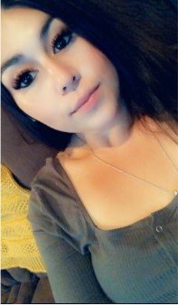
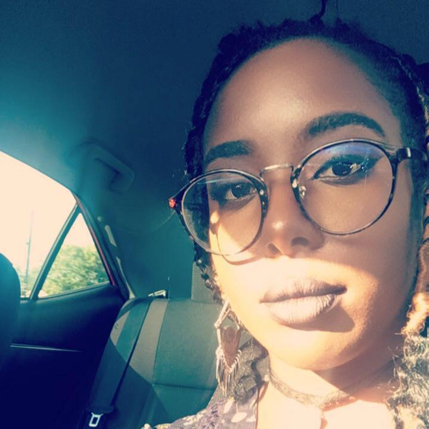

 <h1>ART PORTFOLIO</h1>
- - - - 
<h2>Mission Statement</h2>
Our mission is to help Artists showcase their art no matter what medium. 
Inspire, Showcase, Discover & Connect with Artists worldwide.

<h2>Challenges:</h2>
Creatives often don’t get to take their art and make a living from it. They rely on social platforms to showcase it & build community. There is a need for a professional showcasing platform. We want to help those artists have a place that they can come and post their art in a professional environment. While also providing a space for people to discover artist portfolio work.
 
The creatives community come from all over the world, all walks of life & are brought together with one purpose. Sharing & discovering artist & art.

<h2>Our Team</h2>

<h3>UI/UX Designer<h3>

[<h4>Katharine Holderfield</h4>](https://www.linkedin.com/in/katharineashley/)
 

<h3>UI Developer<h3>

[<h4>Tatyana Novell</h4>](https://www.linkedin.com/in/tatyana-novell-b0168bb1/)
 

